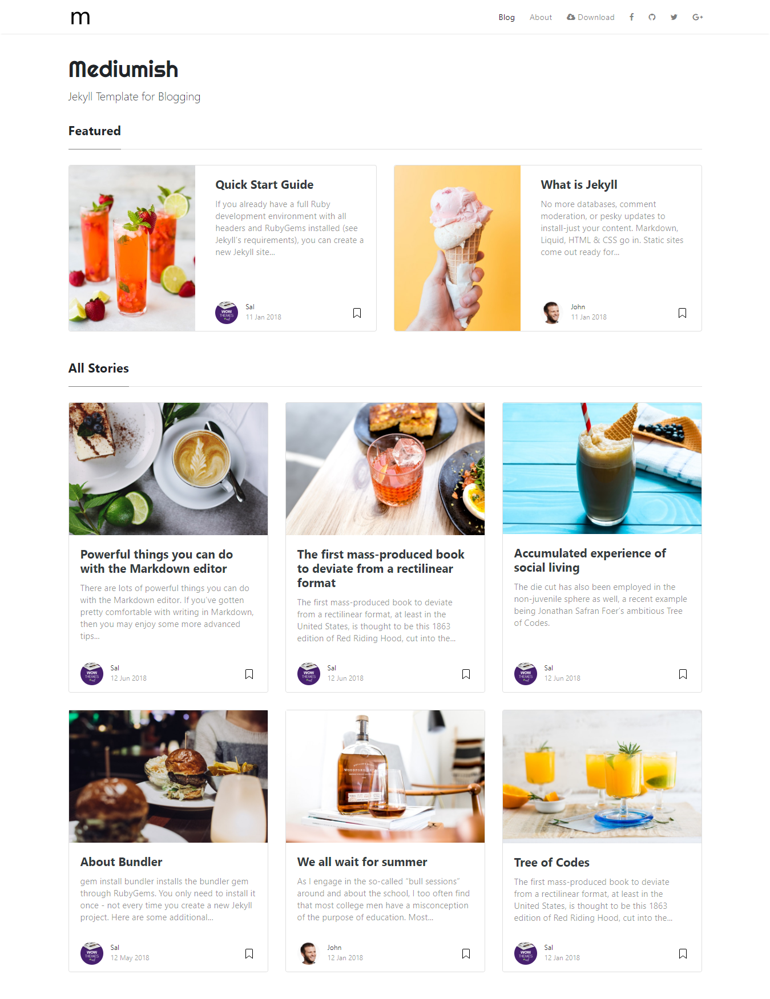

# Guidelines
* The basic structure has been setup with [Jekyll](www.jekyllrb.com). You do not need to know how to use it from a dev standpoint, unless you are interested in contributing to the layout. You need to know only how to create posts with it, which will be covered soon.
* **DO NOT WORK ON THE MASTER**. Fork or work on a new branch and then merge it with master later.
* **TEST YOUR CODE BEFORE MERGING WITH MASTER**

This is the theme implemented:

# Mediumish - Jekyll Theme

## Installation

- Clone this repo
- Navigate to the root of this directory and install (use `sudo` if required)

`gem install bundler`

`bundle install`

- To get the live demo, run the following command and check your terminal for the link to the website

`bundle exec jekyll serve --watch`

## Markdown tips and tricks

- **Syntax highlighting in codeblocks:** Write the language name after the three backticks to apply its syntax highlighting
Example:
```python
def fizz(buzz):
	print("This is a print statement, or is it?")
```
*vs*
```
def fizz(buzz):
	print("This is a print statement, or is it?")
```

## Points to remember

- Do not use copyrighted images
- Add tags and categories as required

## The template

[Live Demo](https://wowthemesnet.github.io/mediumish-theme-jekyll/) &nbsp; | &nbsp; [Download](https://github.com/wowthemesnet/mediumish-theme-jekyll/archive/master.zip) &nbsp; | &nbsp; [Documentation](https://bootstrapstarter.com/bootstrap-templates/template-mediumish-bootstrap-jekyll/) &nbsp; | &nbsp; [Buy me a coffee](https://www.wowthemes.net/donate/)


